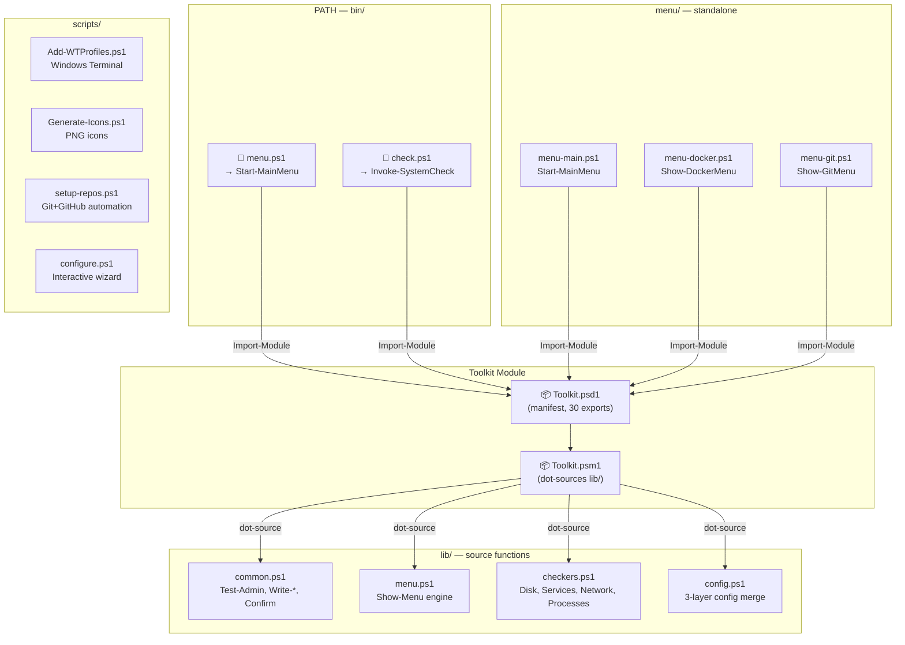
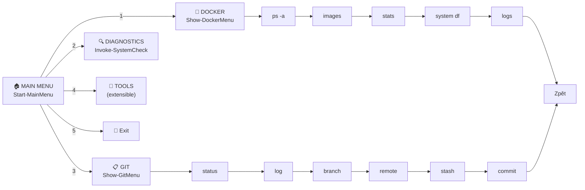

# dotfiles-tools

> **PowerShell toolbox** — interactive menus with live status detection, system diagnostics, Docker & Git helpers, Toolkit module with 36 functions.

[](#)
[](#)
[](#)
[](#)
[](#)

---

## 🔗 Repo Boundary

| Companion repo (`dotfiles-powershell`) | This repo (`dotfiles-tools`) |
|----------------------------------------|-------------------------------|
| `~/.config/powershell/` | `~/Projects/tools/` |
| Profile orchestration | Menu & diagnostics |
| Bootstrap & install | Toolkit PowerShell module |
| Version/host profiles | Windows Terminal integration |
| Secret management helpers | Pester tests (63 cases) |
| 👉 **[github.com/martinpaprcka77/dotfiles-powershell](https://github.com/martinpaprcka77/dotfiles-powershell)** | 👉 **[github.com/martinpaprcka77/dotfiles-tools](https://github.com/martinpaprcka77/dotfiles-tools)** |
| **🌐 Portal: [martinpaprcka77.github.io](https://martinpaprcka77.github.io)** | |

---

## 📊 Summary

| What | Details |
|------|---------|
| **Location** | `~/Projects/tools/` |
| **36 functions** | Toolkit module — menu engine, live-status detectors, diagnostics, utilities, logging, config, modulepath |
| **5 bin scripts** | `menu.ps1`, `check.ps1`, `configure.ps1`, `setup-repos.ps1` + scripts |
| **7 menus** | Main, Docker, Git, Terminal, Dotfiles, Pwsh, VSCode (numbered, extensible, live per-item status) |
| **8 helper scripts** | Add-WTProfiles, Generate-Icons, configure, setup-repos, deps, windows, modernize, precheck |
| **63 Pester tests** | Module structure, function exports, Mock coverage, config, error paths, PSModulePath |

---

## 🧩 Architecture (UML)



### Menu Hierarchy



---

## 🚀 Quick Start

```powershell
git clone https://github.com/martinpaprcka77/dotfiles-tools.git ~/Projects/tools
# Requires dotfiles-powershell installed first!

# After install (bin/ is in PATH):
menu          # interactive main menu
check         # system diagnostics

# Or directly:
Import-Module ~/Projects/tools/Toolkit/Toolkit.psd1
Start-MainMenu
Invoke-SystemCheck
```

---

## 📦 Toolkit Module — 36 Functions

| Category | Function | Purpose |
|----------|----------|---------|
| **Menu** | `Start-MainMenu` | Main interactive menu (9 items) |
| | `Show-DockerMenu` | Docker container management |
| | `Show-GitMenu` | Git operations |
| | `Show-TerminalMenu` | WT profiles, schemes, fonts, shell integration |
| | `Show-DotfilesMenu` | Install, update, backup, restore, clean |
| | `Show-PwshMenu` | Profile edit, reload, benchmark, performance |
| | `Show-VSCodeMenu` | VS Code settings, tasks, agent, extensions |
| | `Show-Menu` | Generic arrow-key menu engine |
| **Diagnostics** | `Invoke-SystemCheck` | Full system health check |
| | `Get-DiskStatus` | Disk space & usage |
| | `Get-ServiceStatus` | Key services (WinRM, Docker, …) |
| | `Get-NetworkInfo` | IP addresses & interfaces |
| | `Get-TopProcesses` | Top 10 by CPU |
| **Utility** | `Test-Admin` | Check admin privileges |
| | `Get-ScriptDirectory` | Resolve caller path |
| | `Confirm-Action` | Y/N prompt |
| **Logging** | `Write-Info` / `Write-Success` | Info & success messages |
| | `Write-Warn` / `Write-Err` | Warning & error messages |
| **Config** | `Get-ToolkitConfig` | Merge defaults + JSON + env |
| | `Save-ToolkitConfig` | Save config to disk |
| | `Merge-Hashtable` | Deep merge two hashtables |
| **PSModulePath** | `Get-PSModulePath` | List entries with validation status |
| | `Add-PSModulePath` | Add a path (no duplicates) |
| | `Remove-PSModulePath` | Remove a path by index or value |
| | `Reset-PSModulePath` | Reset to modern baseline |
| | `Export-PSModulePath` | Save current paths to JSON |
| | `Import-PSModulePath` | Restore paths from JSON |
| | `Test-PSModulePath` | Validate (duplicates, missing dirs, OneDrive, priority) |
| **Detectors** | `Get-ModuleStackStatus` | Show-Menu live status: legacy vs. modern module stack |
| | `Test-LegacyPowerShellGetPresent` | Predicate shared with `modernize.ps1` — same source of truth |
| | `Test-PSResourceGetReady` | Predicate shared with `modernize.ps1` — same source of truth |
| | `Get-DotfilesCompanionStatus` | Show-Menu live status: is the companion profile loaded? |
| | `Get-ModulePathStatus` | Show-Menu live status: PSModulePath health |
| | `Invoke-IfAvailable` | Guard: runs an action only if its command is loaded |

---

## 📂 Files

```
~/Projects/tools/
├── bin/
│   ├── menu.ps1              ← launch main menu
│   └── check.ps1             ← system diagnostics
├── lib/
│   ├── common.ps1            ← utility & logging functions
│   ├── menu.ps1              ← Show-Menu engine (arrow-key nav + live status column)
│   ├── checkers.ps1          ← disk, services, network, processes
│   ├── config.ps1            ← 3-layer config (defaults → JSON → env)
│   ├── modulepath.ps1        ← PSModulePath manager (get/add/remove/reset/export/import/test)
│   └── detectors.ps1         ← Show-Menu live-status detectors (module stack, companion-repo, PSModulePath)
├── Toolkit/
│   ├── Toolkit.psd1          ← module manifest (36 exports)
│   └── Toolkit.psm1          ← module body
├── menu/
│   ├── menu-main.ps1         ← Start-MainMenu
│   ├── menu-docker.ps1       ← Show-DockerMenu
│   ├── menu-git.ps1          ← Show-GitMenu
│   ├── menu-terminal.ps1     ← Show-TerminalMenu
│   ├── menu-dotfiles.ps1     ← Show-DotfilesMenu
│   ├── menu-pwsh.ps1         ← Show-PwshMenu
│   └── menu-vscode.ps1       ← Show-VSCodeMenu
├── scripts/
│   ├── Add-WTProfiles.ps1    ← WT fragment generator (4 profiles + 7 schemes)
│   ├── Generate-Icons.ps1    ← PNG icon generator
│   ├── configure.ps1         ← interactive config wizard
│   ├── setup-repos.ps1       ← Git+GitHub automation
│   ├── deps.ps1              ← winget dependency installer
│   ├── windows.ps1           ← Windows defaults (Explorer, privacy)
│   └── precheck.ps1          ← 30+ inventory checks
├── configs/
│   ├── settings.json         ← default config
│   └── wt-schemes.json       ← WT color schemes (single source of truth, read by Add-WTProfiles.ps1)
├── tests/Toolkit.Tests.ps1   ← 63 Pester test cases
├── docs/                     ← ARCHITECTURE, MANUAL, ROADMAP, PROMPT
└── .gitignore
```

---

## 📖 Docs

| Document | Description |
|----------|-------------|
| [ARCHITECTURE.md](docs/ARCHITECTURE.md) | 4 Mermaid diagrams — components, WT sequence, menu engine, hierarchy, dependency chain |
| [MANUAL.md](docs/MANUAL.md) | 15-section user guide — every script with examples |
| [ROADMAP.md](docs/ROADMAP.md) | 5 phases — completed, planned, known issues |
| [PROMPT.md](docs/PROMPT.md) | Original AI prompt |

---

## 🧪 Tests

```powershell
Install-Module Pester -Force
Invoke-Pester ~/Projects/tools/tests/Toolkit.Tests.ps1
```

**63 test cases**: module structure, function exports, utility behavior with Mocks, config env-var overrides, menu error paths, system check mocks, PSModulePath management. 10 fail on Linux specifically — traced to two known, non-blocking causes (missing platform guards on genuinely Windows-only checkers, and `[IO.Path]::PathSeparator` colliding with Windows drive-letter colons in test fixtures) — not real bugs in the functions under test.

---

## 🏷️ Companion Repo

The **dotfiles-powershell** repo provides the profile orchestration, install/bootstrap, and secret management:  
👉 **[github.com/martinpaprcka77/dotfiles-powershell](https://github.com/martinpaprcka77/dotfiles-powershell)**
