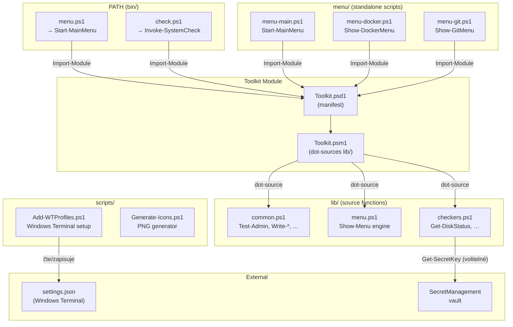
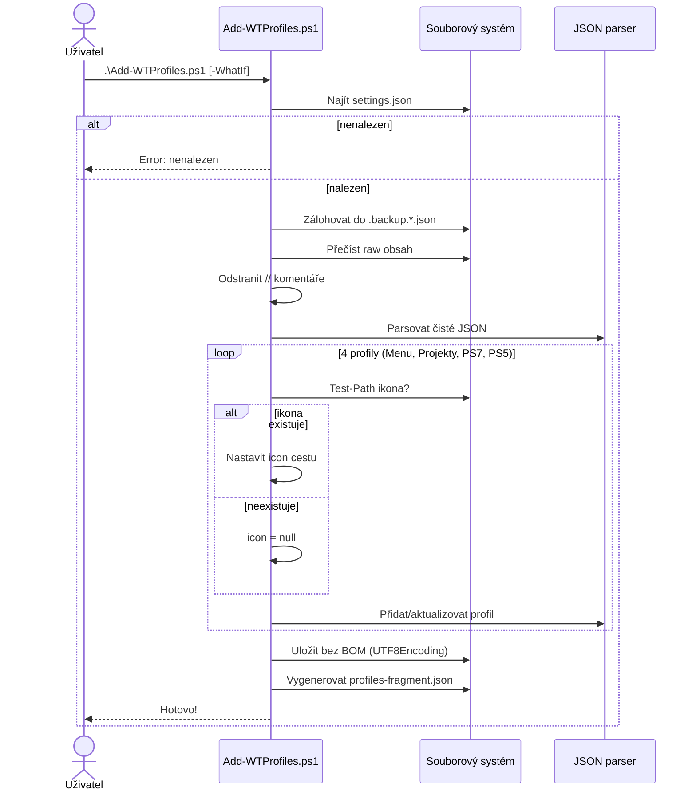
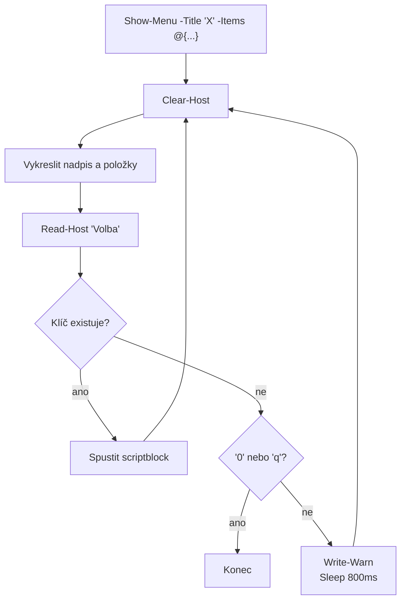
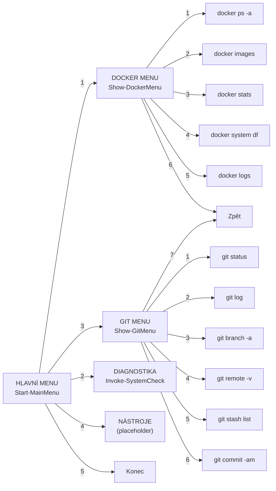

# Architektura dotfiles-tools

## Komponentový diagram



## Datový tok: Add-WTProfiles.ps1



## Menu engine (Show-Menu)



## Hierarchie menu



## Vztah bin/ ↔ Toolkit ↔ lib/

```
bin/menu.ps1                  bin/check.ps1
    │                           │
    │ Import-Module             │ Import-Module
    ▼                           ▼
┌─────────────────────────────────────────┐
│           Toolkit.psd1 (manifest)       │
│  FunctionsToExport: 30 functions         │
└─────────────────────────────────────────┘
    │
    │ RootModule
    ▼
┌─────────────────────────────────────────┐
│           Toolkit.psm1 (module)         │
│  dot-sources all lib/*.ps1               │
│  Export-ModuleMember -Function @(...)    │
└─────────────────────────────────────────┘
    │
    │ dot-source
    ▼
┌────────────┐ ┌────────────┐ ┌──────────────┐
│ common.ps1 │ │ menu.ps1   │ │ checkers.ps1  │
└────────────┘ └────────────┘ └──────────────┘
```

## GUID profilů Windows Terminal

| Profil | GUID | Příkaz |
|--------|------|--------|
| Menu | `{11111111-1111-1111-1111-111111111111}` | `pwsh.exe` → `menu-main.ps1` |
| Projekty | `{22222222-2222-2222-2222-222222222222}` | `pwsh.exe` → `~/Projects/work` |
| PowerShell 7 | `{33333333-3333-3333-3333-333333333333}` | `pwsh.exe` → `~` |
| WinPS 5.1 | `{44444444-4444-4444-4444-444444444444}` | `powershell.exe` → `~` |
