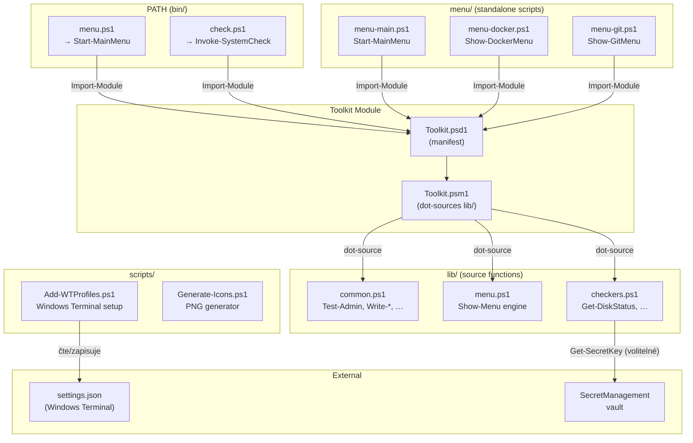
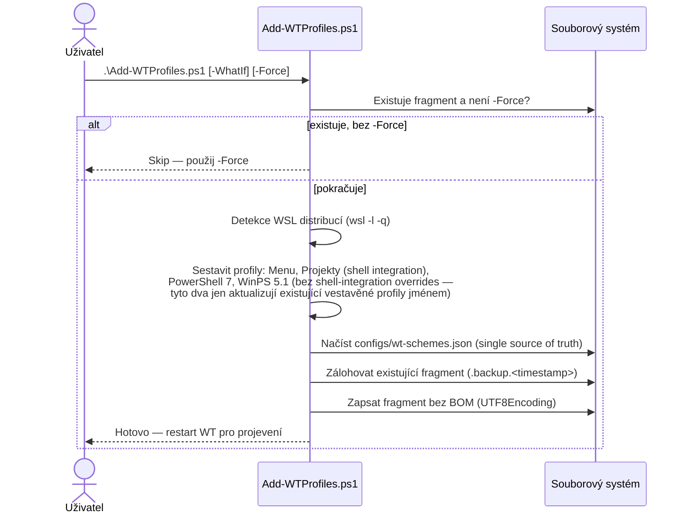
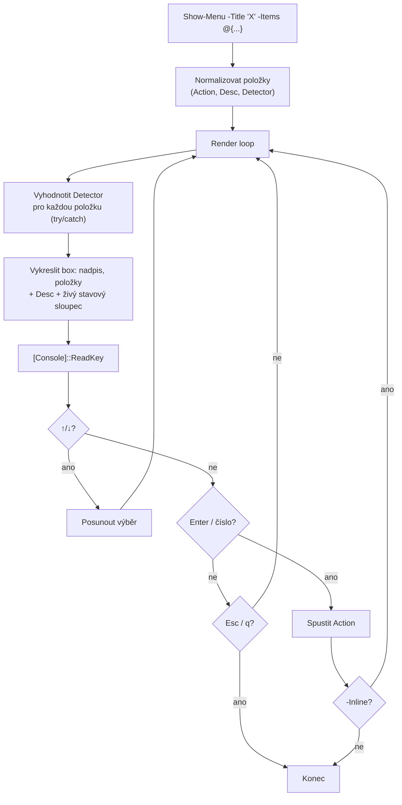
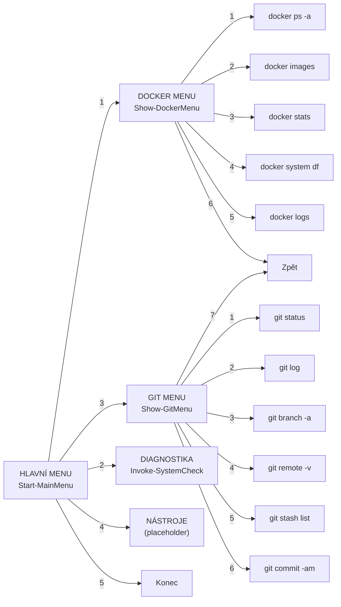

# Architektura dotfiles-tools

## Komponentový diagram



## Datový tok: Add-WTProfiles.ps1

Reálná implementace **negeneruje settings.json editaci ani neodstraňuje `//` komentáře** — to
byl starší návrh. Od WT 1.24+ se používá **JSON fragment extension**
(`%LOCALAPPDATA%\Microsoft\Windows Terminal\Fragments\dotfiles\dotfiles.json`), kterou WT čte
automaticky bez zásahu do uživatelova `settings.json`. Profily se párují podle `name`, ne GUID —
žádné GUID se nikde negenerují ani nepoužívají.



## Menu engine (Show-Menu)

Skutečná implementace používá **arrow-key navigaci přes `[Console]::ReadKey`**, ne číslované
`Read-Host` vstupy (číselné zkratky fungují taky, jako doplněk). Každá položka může nést
volitelný `Detector` scriptblock, který se vyhodnotí znovu při každém překreslení a zobrazí
živý stavový sloupec (✅/⚠️/❌ + text) vedle popisu.



## Hierarchie menu



## Vztah bin/ ↔ Toolkit ↔ lib/

```
bin/menu.ps1                  bin/check.ps1
    │                           │
    │ Import-Module             │ Import-Module
    ▼                           ▼
┌─────────────────────────────────────────┐
│           Toolkit.psd1 (manifest)       │
│  FunctionsToExport: 36 functions         │
└─────────────────────────────────────────┘
    │
    │ RootModule
    ▼
┌─────────────────────────────────────────┐
│           Toolkit.psm1 (module)         │
│  dot-sources all lib/*.ps1               │
│  Export-ModuleMember -Function @(...)    │
└─────────────────────────────────────────┘
    │
    │ dot-source
    ▼
┌────────────┐ ┌────────────┐ ┌──────────────┐
│ common.ps1 │ │ menu.ps1   │ │ checkers.ps1  │
└────────────┘ └────────────┘ └──────────────┘
```

## Profily Windows Terminal (fragment extension, párováno jménem)

Žádné GUID — WT fragment extensions párují profily podle `name`. `Menu`/`Projekty` jsou nové
vlastní profily (shell integration povolena). `PowerShell 7`/`Windows PowerShell 5.1` **aktualizují
existující vestavěné profily stejného jména** — záměrně jen o `icon`/`tabTitle`, nikdy o
font/colorScheme/shell-integration, aby se tiše nepřepsalo uživatelovo vlastní nastavení.

| Profil | Typ | Příkaz |
|--------|-----|--------|
| Menu | nový, vlastní | `pwsh.exe` → `menu-main.ps1` |
| Projekty | nový, vlastní | `pwsh.exe` → `~/Projects/work` |
| PowerShell 7 | update vestavěného | `pwsh.exe` → `~` |
| Windows PowerShell 5.1 | update vestavěného | `powershell.exe` → `~` |
| WSL: `<distro>` | auto-detekováno (`wsl -l -q`) | `wsl.exe -d <distro>` |
